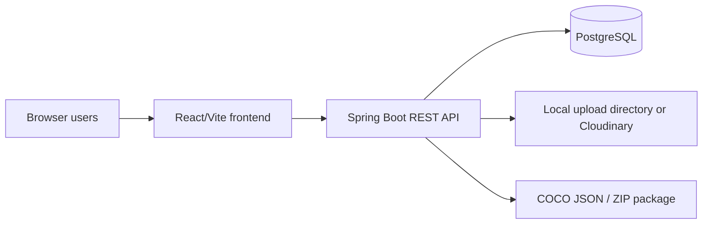

# Data Labeling Support System

Data Labeling Support System (DLSS) is a web application for managing image
annotation projects. It supports dataset upload, label taxonomy management,
task assignment, bounding-box annotation, reviewer approval, audit logging,
project dashboards, and COCO export for object-detection training pipelines.

The project is organized as a React frontend and a Spring Boot backend with a
PostgreSQL database.

## Architecture



## Core Roles

| Role | Main responsibility |
| --- | --- |
| ADMIN | Manage users, groups, projects, system configuration, dashboards, audit logs, and global data access. |
| MANAGER | Create projects, attach datasets, define labels, assign or split tasks, monitor progress, and export completed annotations. |
| ANNOTATOR | View assigned projects/tasks, draw bounding boxes, save work, and submit ready images for review. |
| REVIEWER | Review submitted annotations, approve valid tasks, reject invalid tasks, and provide defect feedback. |

## Main Capabilities

- Authentication with JWT and role-based access control.
- User and group management, including manager-scoped annotator/reviewer access.
- Project CRUD with soft delete, manager assignment, reviewer assignment, labels, files, and task statistics.
- Dataset CRUD, image upload, sample metadata, pagination, and soft delete.
- Task generation from datasets, assignment to annotators, workload reporting, and split by equal share or percentage.
- Annotation storage for normalized bounding boxes in JSONB.
- Review queue with approval, rejection, defect categories, review history, and review statistics.
- Dashboards for managers and administrators.
- Performance analytics for users and projects.
- COCO export as JSON and ZIP package with images and an export manifest.
- Activity logging for audited API actions.

## Tech Stack

| Layer | Technology |
| --- | --- |
| Frontend | React 19, Vite 7, React Router, Axios, Tailwind/PostCSS, lucide-react, framer-motion |
| Backend | Java 21, Spring Boot 4, Spring Security, Spring Data JPA, Spring Validation, Spring MVC |
| Database | PostgreSQL, JSONB columns, Flyway migration files |
| API docs | springdoc OpenAPI / Swagger UI |
| Storage | Local filesystem by default, optional Cloudinary strategy |
| Tests | JUnit, Spring test modules, H2 for test profile, frontend ESLint/build |

## Repository Structure

```text
backend/
  src/main/java/com/uth/datalabeling/
    common/          Shared responses, exceptions, storage helpers
    config/          Security, CORS, Swagger, Cloudinary config
    modules/         Feature modules by domain
    security/jwt/    JWT provider, filter, entry point, access denied handler
  src/main/resources/
    db/migration/    Database evolution scripts
frontend/
  src/pages/         Role-based screens
  src/components/    Shared UI and role-specific components
  src/services/      Axios API clients
docs/
  api-reference.md
  system-design.md
  testing-validation.md
database-schema.md
```

## Run Locally

Start PostgreSQL and pgAdmin:

```bash
docker compose up -d
```

Run the backend:

```bash
cd backend
./mvnw spring-boot:run
```

Run the frontend:

```bash
cd frontend
npm install
npm run dev
```

Default local URLs:

| Service | URL |
| --- | --- |
| Frontend | `http://localhost:5173` |
| Backend API | `http://localhost:8080/api/v1` |
| Swagger UI | `http://localhost:8080/api/v1/swagger-ui/index.html` |
| pgAdmin | `http://localhost:5050` |

## Configuration

Backend configuration is driven by environment variables with defaults in
`backend/src/main/resources/application.properties`.

| Variable | Default | Purpose |
| --- | --- | --- |
| `SERVER_PORT` | `8080` | Backend HTTP port |
| `CONTEXT_PATH` | `/api/v1` | API context path |
| `DB_URL` | `jdbc:postgresql://localhost:5432/datalabeling` | PostgreSQL JDBC URL |
| `DB_USERNAME` | `postgres` | Database user |
| `DB_PASSWORD` | `secret` | Database password |
| `JWT_SECRET` | development secret | JWT signing key |
| `JWT_EXPIRATION` | `3600` | Token lifetime in seconds |
| `CORS_ALLOWED_ORIGINS` | local frontend origins | Allowed browser origins |
| `UPLOAD_DIR` | `uploads/` | Local upload root |
| `STORAGE_STRATEGY` | `local` | `local` or `cloudinary` |
| `CLOUDINARY_URL` | empty | Cloudinary connection string |

## Documentation

- [System design](docs/system-design.md)
- [API reference](docs/api-reference.md)
- [Database schema](database-schema.md)
- [Testing and validation](docs/testing-validation.md)

## Verification

Backend:

```bash
cd backend
./mvnw -q -DskipTests compile
./mvnw test
```

Frontend:

```bash
cd frontend
npm run lint
npm run build
```

## Current Documentation Source of Truth

When implementation and documentation disagree, use the following source order:

1. Backend controllers, services, entities, and migrations.
2. Frontend route/page implementation.
3. Repository documentation.
4. Confluence project report.
