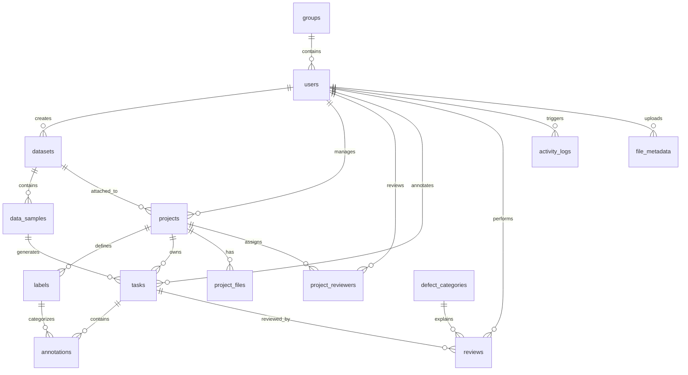

# Data Labeling Support System Database Schema

This document summarizes the current logical schema implemented by the backend
entities and migration scripts under `backend/src/main/resources/db/migration`.
The application uses PostgreSQL and several JSONB columns for flexible metadata.

## Schema Notes

- Most domain identifiers are UUID values.
- Project and dataset deletion is soft-delete based through `deleted_at`.
- Annotation geometry is stored as normalized bounding-box ratios in JSONB:
  `{ "x": number, "y": number, "width": number, "height": number }`.
- Runtime configuration currently maps to the singleton
  `system_configuration` table, not the older `system_configs` key/value model.
- Audit records are stored in `activity_logs`, not `audit_logs`.

## Table Summary

| Table | Purpose |
| --- | --- |
| `users` | User accounts, credentials, role, active flag, and optional group membership. |
| `groups` | Work groups managed by managers; used to scope annotator/reviewer visibility. |
| `datasets` | Dataset records created by users. |
| `data_samples` | Image samples attached to datasets, including URL/path and metadata. |
| `projects` | Labeling projects with manager, dataset, status, audit fields, and soft delete. |
| `project_reviewers` | Many-to-many reviewer assignment for projects. |
| `labels` | Project-local annotation labels and display colors. |
| `tasks` | Annotation work items generated from project dataset samples. |
| `annotations` | Bounding-box annotations saved for tasks. |
| `defect_categories` | Rejection reason taxonomy. |
| `reviews` | Reviewer approve/reject actions for tasks. |
| `activity_logs` | Audited API activity, endpoint, method, status, and before/after payloads. |
| `system_configuration` | Singleton application settings row. |
| `project_files` | Guideline or supporting files uploaded for a project. |
| `file_metadata` | Uploaded file metadata shared by image/file storage features. |

## Core Tables

### `users`

| Column | Type | Constraint / Meaning |
| --- | --- | --- |
| `id` | UUID | Primary key |
| `email` | VARCHAR | Unique login identity |
| `full_name` | VARCHAR | Display name |
| `password` / `password_hash` | VARCHAR | Encoded credential, depending on entity/migration evolution |
| `role` | VARCHAR | `ADMIN`, `MANAGER`, `ANNOTATOR`, or `REVIEWER` |
| `is_active` | BOOLEAN | Active/deactivated account state |
| `group_id` | UUID | Optional reference to `groups.id` |
| `created_at`, `updated_at` | TIMESTAMP | Audit timestamps |

### `groups`

| Column | Type | Constraint / Meaning |
| --- | --- | --- |
| `id` | UUID | Primary key |
| `name` | TEXT | Unique group name |
| `description` | TEXT | Optional group description |
| `manager_id` | UUID | Optional reference to `users.id` |
| `created_at`, `updated_at` | TIMESTAMPTZ | Audit timestamps |

### `datasets`

| Column | Type | Constraint / Meaning |
| --- | --- | --- |
| `id` | UUID | Primary key |
| `name` | VARCHAR/TEXT | Dataset name |
| `description` | TEXT | Optional description |
| `creator_id` | UUID | Optional reference to `users.id` |
| `created_at`, `updated_at` | TIMESTAMP | Audit timestamps |
| `deleted_at` | TIMESTAMPTZ | Soft delete marker |

### `data_samples`

| Column | Type | Constraint / Meaning |
| --- | --- | --- |
| `id` | UUID | Primary key |
| `dataset_id` | UUID | Reference to `datasets.id` |
| `image_url` | TEXT/VARCHAR | Local path, served upload path, or external URL |
| `metadata` | JSONB | File name, size, format, width, height, and optional metadata |
| `created_at` | TIMESTAMP | Creation timestamp |

### `projects`

| Column | Type | Constraint / Meaning |
| --- | --- | --- |
| `id` | UUID | Primary key |
| `name` | TEXT | Unique among non-deleted projects |
| `description` | TEXT | Optional project description |
| `guideline_url` | TEXT | Optional guideline link |
| `status` | VARCHAR | `DRAFT`, `ACTIVE`, or `ARCHIVED` |
| `manager_id` | UUID | Nullable manager reference |
| `dataset_id` | UUID | Optional reference to `datasets.id` |
| `version` | BIGINT | Optimistic locking field |
| `created_by`, `updated_by` | UUID | Audit users |
| `created_at`, `updated_at` | TIMESTAMPTZ | Audit timestamps |
| `deleted_at` | TIMESTAMPTZ | Soft delete marker |

### `project_reviewers`

| Column | Type | Constraint / Meaning |
| --- | --- | --- |
| `project_id` | UUID | Reference to `projects.id`, part of primary key |
| `reviewer_id` | UUID | Reference to `users.id`, part of primary key |

### `labels`

| Column | Type | Constraint / Meaning |
| --- | --- | --- |
| `id` | UUID | Primary key |
| `project_id` | UUID | Reference to `projects.id` |
| `name` | TEXT | Unique per active project label set |
| `color_hex` | VARCHAR(7) | Hex display color |
| `created_at`, `updated_at` | TIMESTAMPTZ | Audit timestamps |
| `deleted_at` | TIMESTAMPTZ | Soft delete marker |

### `tasks`

| Column | Type | Constraint / Meaning |
| --- | --- | --- |
| `id` | UUID | Primary key |
| `project_id` | UUID | Reference to `projects.id` |
| `sample_id` | UUID | Reference to `data_samples.id` |
| `annotator_id` | UUID | Optional assigned annotator |
| `status` | VARCHAR | Task lifecycle state |
| `assigned_at` | TIMESTAMP | Assignment timestamp |
| `created_at`, `updated_at` | TIMESTAMP | Audit timestamps |

Task status values used by the application:

| Status | Meaning |
| --- | --- |
| `PENDING` | Generated but not assigned. |
| `ASSIGNED` | Assigned to an annotator. |
| `IN_PROGRESS` | Annotator opened/saved work without annotations or still working. |
| `READY_FOR_REVIEW` | Annotator saved annotations but has not bulk-submitted. |
| `PENDING_REVIEW` | Submitted to reviewer queue. |
| `COMPLETED` | Approved by reviewer. |
| `REJECTED` | Rejected and returned for correction. |

### `annotations`

| Column | Type | Constraint / Meaning |
| --- | --- | --- |
| `id` | UUID | Primary key |
| `task_id` | UUID | Reference to `tasks.id` |
| `label_id` | UUID | Reference to `labels.id` |
| `created_by` | UUID | Optional reference to `users.id` |
| `shape_type` | VARCHAR | Currently `BOUNDING_BOX` |
| `geometry` | JSONB | Normalized bounding-box geometry |
| `is_ai_generated` | BOOLEAN | Whether annotation was AI-generated |
| `created_at`, `updated_at` | TIMESTAMP | Audit timestamps |

### `reviews`

| Column | Type | Constraint / Meaning |
| --- | --- | --- |
| `id` | UUID | Primary key |
| `task_id` | UUID | Reviewed task |
| `reviewer_id` | UUID | Reviewing user |
| `defect_category_id` | UUID | Optional rejection category |
| `comments` | TEXT | Reviewer comments |
| `action` | VARCHAR | `APPROVED` or `REJECTED` |
| `created_at`, `updated_at` | TIMESTAMP | Audit timestamps |

### `activity_logs`

| Column | Type | Constraint / Meaning |
| --- | --- | --- |
| `id` | UUID | Primary key |
| `user_id` | UUID | Optional acting user |
| `action` | VARCHAR | Action name |
| `endpoint` | VARCHAR | Request endpoint |
| `method` | VARCHAR | HTTP method |
| `ip_address` | VARCHAR | Client IP |
| `status` | INTEGER | HTTP response status |
| `duration_ms` | BIGINT | Request duration |
| `entity_id` | UUID | Optional affected entity |
| `entity_type` | VARCHAR | Optional affected entity type |
| `old_value`, `new_value` | TEXT | Serialized before/after values |
| `created_at` | TIMESTAMP | Log timestamp |

### `system_configuration`

| Column | Type | Constraint / Meaning |
| --- | --- | --- |
| `id` | INTEGER | Singleton primary key, normally `1` |
| `max_image_file_size_mb` | INTEGER | Upload size limit |
| `ai_labeling_enabled` | BOOLEAN | Feature flag |
| `default_page_size` | INTEGER | Pagination default |
| `allowed_image_extensions` | VARCHAR | Comma-separated allowed extensions |
| `updated_by` | VARCHAR | Email/user marker of last update |
| `version` | BIGINT | Optimistic locking field |
| `created_at`, `updated_at` | TIMESTAMP | Audit timestamps |

### `project_files`

| Column | Type | Constraint / Meaning |
| --- | --- | --- |
| `id` | UUID | Primary key |
| `project_id` | UUID | Reference to `projects.id` |
| `file_name` | VARCHAR | Original file name |
| `file_type` | VARCHAR | MIME type |
| `file_path` | TEXT/VARCHAR | Storage path |
| `file_size` | BIGINT | File size |
| `uploaded_at` | TIMESTAMP | Upload timestamp |

### `file_metadata`

| Column | Type | Constraint / Meaning |
| --- | --- | --- |
| `id` | UUID | Primary key |
| `file_name` | VARCHAR | Original file name |
| `file_path` | TEXT | Storage path |
| `format` | VARCHAR | File extension/format |
| `size_bytes` | BIGINT | File size |
| `uploader_id` | UUID | Optional reference to `users.id` |
| `metadata` | JSONB | Additional metadata |
| `created_at`, `updated_at` | TIMESTAMP | Audit timestamps |

## Relationships

## Integrity Rules

- Project names are unique among non-deleted projects.
- Label names are unique per project among non-deleted labels.
- A project/sample pair cannot produce duplicate tasks.
- Managers can access projects they own; admins can access all projects.
- Reviewer visibility is group-scoped through the project manager's group.
- Annotators can read projects only when tasks are assigned to them.
- COCO export includes `COMPLETED` tasks only and skips images with missing or unreadable dimensions.
