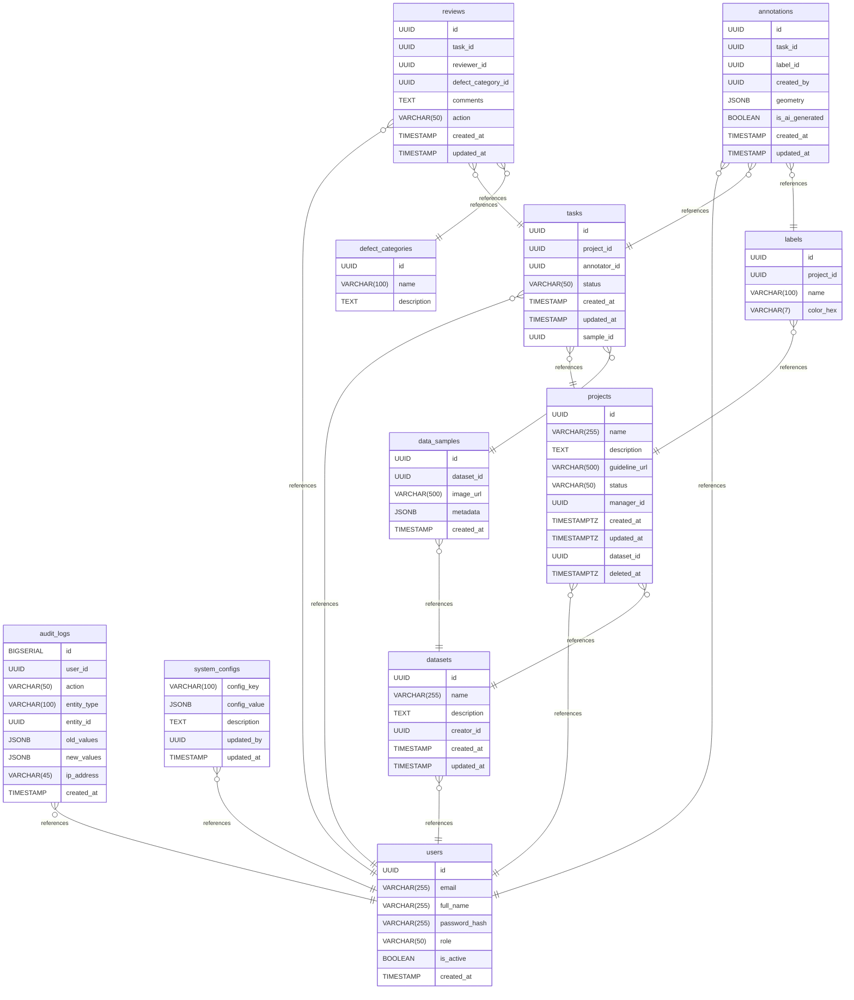

# Data Labeling Support System documentation
## Summary

- [Introduction](#introduction)
- [Database Type](#database-type)
- [Table Structure](#table-structure)
	- [labels](#labels)
	- [annotations](#annotations)
	- [tasks](#tasks)
	- [users](#users)
	- [projects](#projects)
	- [reviews](#reviews)
	- [audit_logs](#audit_logs)
	- [system_configs](#system_configs)
	- [defect_categories](#defect_categories)
	- [datasets](#datasets)
	- [data_samples](#data_samples)
- [Relationships](#relationships)
- [Database Diagram](#database-diagram)

## Introduction

## Database type

- **Database system:** PostgreSQL
## Table structure

### labels

| Name           | Type         | Settings                | References | Note |
| -------------- | ------------ | ----------------------- | ---------- | ---- |
| **id**         | UUID         | 🔑 PK, not null, unique |            |      |
| **project_id** | UUID         | not null                |            |      |
| **name**       | VARCHAR(100) | not null                |            |      |
| **color_hex**  | VARCHAR(7)   | not null                |            |      | 

### annotations

| Name                | Type      | Settings                | References | Note |
| ------------------- | --------- | ----------------------- | ---------- | ---- |
| **id**              | UUID      | 🔑 PK, not null, unique |            |      |
| **task_id**         | UUID      | not null                |            |      |
| **label_id**        | UUID      | not null                |            |      |
| **created_by**      | UUID      | null                    |            |      |
| **geometry**        | JSONB     | not null                |            |      |
| **is_ai_generated** | BOOLEAN   | null, default: FALSE    |            |      |
| **created_at**      | TIMESTAMP | null                    |            |      |
| **updated_at**      | TIMESTAMP | null                    |            |      | 

### tasks

| Name             | Type        | Settings                | References | Note                                    |
| ---------------- | ----------- | ----------------------- | ---------- | --------------------------------------- |
| **id**           | UUID        | 🔑 PK, not null, unique |            |                                         |
| **project_id**   | UUID        | not null                |            |                                         |
| **annotator_id** | UUID        | null                    |            | Nhân sự được phân bổ thực hiện gắn nhãn |
| **status**       | VARCHAR(50) | null, default: PENDING  |            |                                         |
| **created_at**   | TIMESTAMP   | null                    |            |                                         |
| **updated_at**   | TIMESTAMP   | null                    |            |                                         |
| **sample_id**    | UUID        | null                    |            |                                         | 

### users

| Name              | Type         | Settings                 | References | Note                                                    |
| ----------------- | ------------ | ------------------------ | ---------- | ------------------------------------------------------- |
| **id**            | UUID         | 🔑 PK, not null, unique  |            |                                                         |
| **email**         | VARCHAR(255) | not null, unique         |            |                                                         |
| **full_name**     | VARCHAR(255) | not null                 |            |                                                         |
| **password_hash** | VARCHAR(255) | not null                 |            |                                                         |
| **role**          | VARCHAR(50)  | not null                 |            |                                                         |
| **is_active**     | BOOLEAN      | not null, default: TRUE  |            | Mục đích là vô hiệu hóa thay vì xóa vĩnh viễn tài khoản |
| **created_at**    | TIMESTAMP    | not null, default: NOW() |            |                                                         | 

### projects

| Name              | Type         | Settings                       | References | Note |
| ----------------- | ------------ | ------------------------------ | ---------- | ---- |
| **id**            | UUID         | 🔑 PK, not null, unique        |            |      |
| **name**          | VARCHAR(255) | not null                       |            |      |
| **description**   | TEXT         | null                           |            |      |
| **guideline_url** | VARCHAR(500) | null                           |            |      |
| **status**        | VARCHAR(50)  | not null, default: INITIALIZED |            |      |
| **manager_id**    | UUID         | null                           |            |      |
| **created_at**    | TIMESTAMPTZ  | null                           |            |      |
| **updated_at**    | TIMESTAMPTZ  | null                           |            |      |
| **dataset_id**    | UUID         | null                           |            |      |
| **deleted_at**    | TIMESTAMPTZ  | null                           |            |      | 

### reviews

| Name                   | Type        | Settings                | References | Note                                                               |
| ---------------------- | ----------- | ----------------------- | ---------- | ------------------------------------------------------------------ |
| **id**                 | UUID        | 🔑 PK, not null, unique |            |                                                                    |
| **task_id**            | UUID        | not null                |            |                                                                    |
| **reviewer_id**        | UUID        | not null                |            |                                                                    |
| **defect_category_id** | UUID        | null                    |            | Danh mục loại bỏ nếu nhãn không đạt tiêu chuẩn (Null là thông qua) |
| **comments**           | TEXT        | null                    |            |                                                                    |
| **action**             | VARCHAR(50) | not null                |            | Hành động cuối cùng mang giá trị APPROVED hoặc REJECTED.           |
| **created_at**         | TIMESTAMP   | null                    |            |                                                                    |
| **updated_at**         | TIMESTAMP   | null                    |            |                                                                    | 

### audit_logs

| Name            | Type         | Settings                 | References | Note                                                          |
| --------------- | ------------ | ------------------------ | ---------- | ------------------------------------------------------------- |
| **id**          | BIGSERIAL    | 🔑 PK, not null, unique  |            |                                                               |
| **user_id**     | UUID         | not null                 |            |                                                               |
| **action**      | VARCHAR(50)  | not null                 |            |                                                               |
| **entity_type** | VARCHAR(100) | not null                 |            | Tên thực thể dữ liệu bị tác động (USER_ACCOUNT, PROJECT, ...) |
| **entity_id**   | UUID         | not null                 |            | Khóa chính của bản ghi trong bảng thực thể tương ứng          |
| **old_values**  | JSONB        | null                     |            |                                                               |
| **new_values**  | JSONB        | null                     |            |                                                               |
| **ip_address**  | VARCHAR(45)  | not null                 |            |                                                               |
| **created_at**  | TIMESTAMP    | not null, default: NOW() |            |                                                               | 

### system_configs

| Name             | Type         | Settings                 | References | Note                                                               |
| ---------------- | ------------ | ------------------------ | ---------- | ------------------------------------------------------------------ |
| **config_key**   | VARCHAR(100) | 🔑 PK, not null, unique  |            |                                                                    |
| **config_value** | JSONB        | not null                 |            |                                                                    |
| **description**  | TEXT         | null                     |            | Mô tả chức năng để Admin hiểu tác dụng của cấu hình trên giao diện |
| **updated_by**   | UUID         | not null                 |            |                                                                    |
| **updated_at**   | TIMESTAMP    | not null, default: NOW() |            |                                                                    | 

### defect_categories

| Name            | Type         | Settings                | References | Note |
| --------------- | ------------ | ----------------------- | ---------- | ---- |
| **id**          | UUID         | 🔑 PK, not null, unique |            |      |
| **name**        | VARCHAR(100) | not null, unique        |            |      |
| **description** | TEXT         | null                    |            |      | 

### datasets

| Name            | Type         | Settings                | References | Note |
| --------------- | ------------ | ----------------------- | ---------- | ---- |
| **id**          | UUID         | 🔑 PK, not null, unique |            |      |
| **name**        | VARCHAR(255) | null                    |            |      |
| **description** | TEXT         | null                    |            |      |
| **creator_id**  | UUID         | null                    |            |      |
| **created_at**  | TIMESTAMP    | null                    |            |      |
| **updated_at**  | TIMESTAMP    | null                    |            |      | 

### data_samples

| Name           | Type         | Settings                | References | Note |
| -------------- | ------------ | ----------------------- | ---------- | ---- |
| **id**         | UUID         | 🔑 PK, not null, unique |            |      |
| **dataset_id** | UUID         | null                    |            |      |
| **image_url**  | VARCHAR(500) | null                    |            |      |
| **metadata**   | JSONB        | null                    |            |      |
| **created_at** | TIMESTAMP    | null                    |            |      | 

## Relationships

- **audit_logs to users**: many_to_one
- **system_configs to users**: many_to_one
- **reviews to users**: many_to_one
- **annotations to users**: many_to_one
- **tasks to users**: many_to_one
- **projects to users**: many_to_one
- **labels to projects**: many_to_one
- **tasks to projects**: many_to_one
- **annotations to tasks**: many_to_one
- **annotations to labels**: many_to_one
- **reviews to tasks**: many_to_one
- **reviews to defect_categories**: many_to_one
- **datasets to users**: many_to_one
- **data_samples to datasets**: many_to_one
- **tasks to data_samples**: many_to_one
- **projects to datasets**: many_to_one

## Database Diagram

