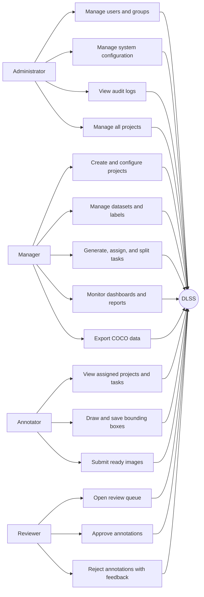
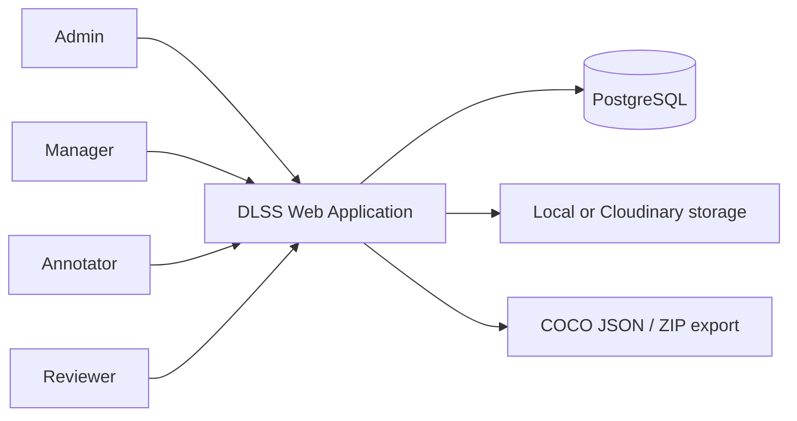
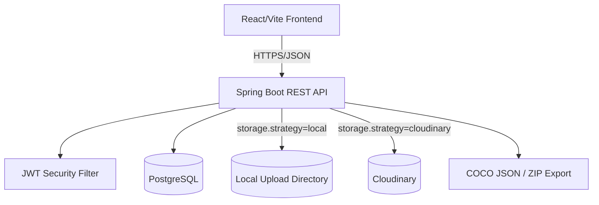
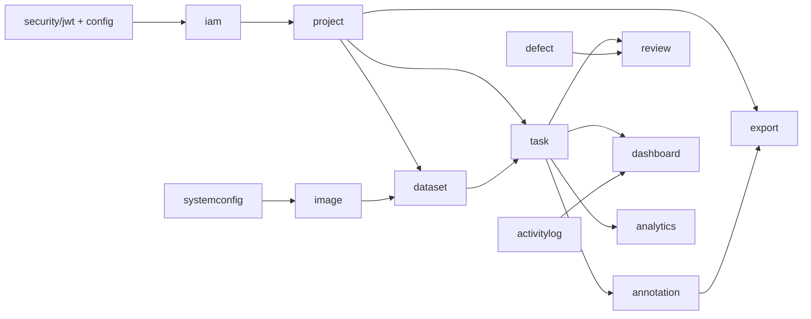
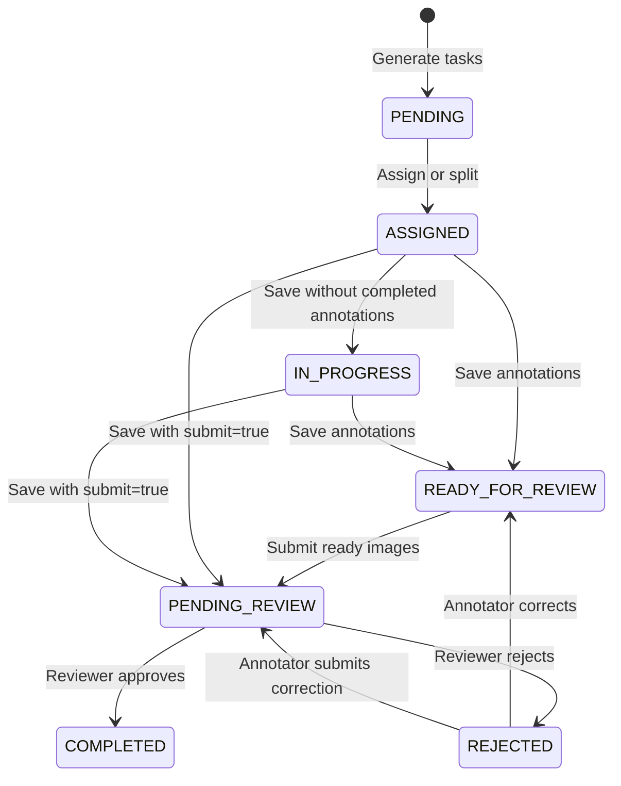
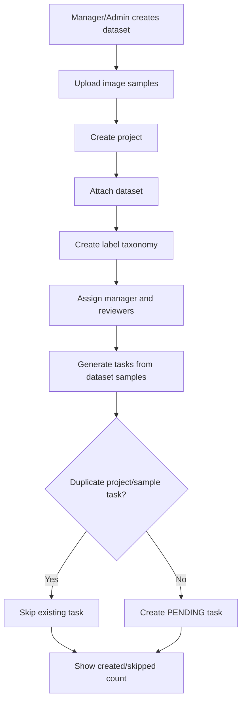
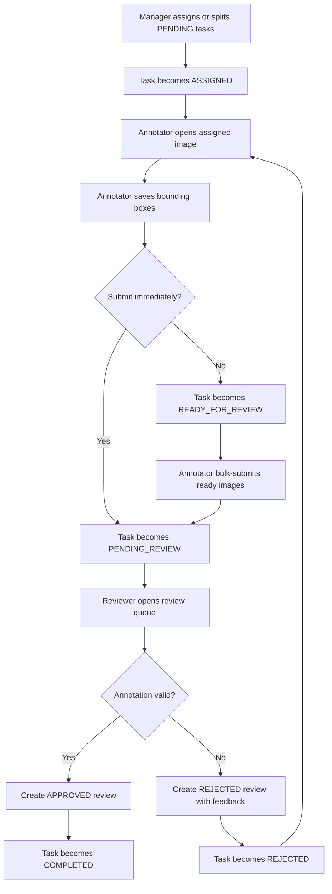
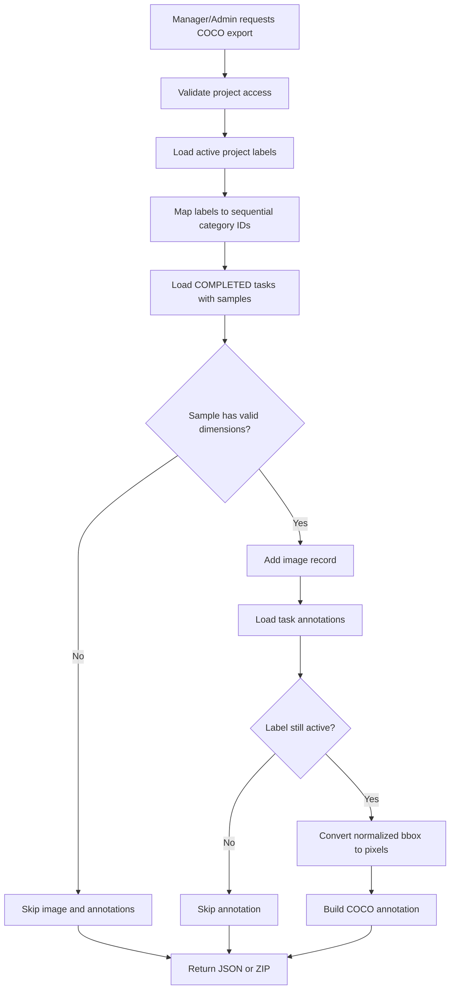

# DLSS System Design

This document describes the current design of the Data Labeling Support System
as implemented in the repository.

## Context

DLSS supports teams that prepare image datasets for computer vision. Managers
create projects, define labels, assign work, and monitor progress. Annotators
draw bounding boxes. Reviewers approve or reject submitted annotations. Admins
manage the platform, users, configuration, and global reporting.

## Diagram Inventory

The project documentation uses diagrams where they clarify a specific view:

| Diagram | Documentation section | Purpose |
| --- | --- | --- |
| Use-case diagram | Requirements / Actor interaction | Shows what each role can do. |
| System context diagram | Architecture context | Shows users and external dependencies around DLSS. |
| Container diagram | Architecture containers | Shows frontend, backend, database, storage, and export boundary. |
| Backend module/component diagram | Building block view | Shows source-level module responsibilities. |
| ERD | Database design | Shows persistent entities and relationships. |
| Task lifecycle state diagram | Workflow / runtime view | Shows status transitions from generated work to reviewed output. |
| Annotation and review flowcharts | Runtime view | Shows representative business workflows. |
| COCO export flowchart | Runtime view / implementation highlight | Shows how export data is selected, transformed, and packaged. |

This placement follows the same separation used by lightweight SRS/SDD
documentation: requirements diagrams explain user intent, architecture diagrams
explain structure, ERDs explain persistence, and flow/sequence diagrams explain
runtime behavior.

## Use-Case View

## Containers

| Container | Responsibility |
| --- | --- |
| React frontend | Role-based user interface, routing, forms, dashboards, annotation workspace, review workspace. |
| Spring Boot API | Authentication, authorization, domain workflows, validation, persistence, export packaging. |
| PostgreSQL | Users, groups, projects, datasets, tasks, annotations, reviews, configuration, and audit logs. |
| Storage | Uploaded image files and project files; local filesystem by default, Cloudinary optional. |

## Backend Modules

| Module | Responsibility |
| --- | --- |
| `iam` | Auth, user CRUD, group management, user/group scoping. |
| `project` | Project lifecycle, manager/reviewer assignment, labels, files, statistics, access rules. |
| `dataset` | Dataset CRUD, data samples, upload-to-sample workflow, soft delete. |
| `task` | Generate, assign, split, list, workload, and annotator task submission. |
| `annotation` | Read/write normalized bounding-box annotations. |
| `review` | Pending review queue, approve/reject actions, history, review statistics. |
| `defect` | Rejection category taxonomy. |
| `export` | COCO JSON and COCO ZIP export. |
| `dashboard` | Admin and manager dashboard summaries. |
| `analytics` | User and project performance metrics. |
| `activitylog` | Audited API activity capture and query. |
| `systemconfig` | Singleton system configuration settings. |
| `image` | Upload validation, local/cloud storage, and served upload files. |

## Frontend Areas

| Area | Screens |
| --- | --- |
| Public/Auth | Landing page, login, unauthorized page. |
| Admin | Dashboard, users/groups, system configuration, logs, projects, datasets, upload/images, label taxonomy. |
| Manager | Dashboard, projects, project detail, datasets, groups, reports/progress. |
| Annotator | Project list, task list, annotation workspace, settings. |
| Reviewer | Review queue, completed review view, review workspace. |

## Role and Access Model

| Role | Write access | Read access highlights |
| --- | --- | --- |
| ADMIN | Global user, group, project, dataset, configuration, defect category, and export operations. | All projects, dashboards, audit logs. |
| MANAGER | Own projects, labels, datasets, tasks, task split/assignment, reviewers, export. | Own projects and scoped group users. |
| ANNOTATOR | Assigned task annotations and ready-for-review submission. | Assigned projects, assigned images, labels, previous rejection feedback. |
| REVIEWER | Review approval/rejection and review history. | Review queue and projects visible through group/project assignment rules. |

Important access rules:

- Admins can read and manage all projects.
- Managers can manage projects where `project.manager_id` is their user ID.
- Managers can assign annotators/reviewers in their current group scope.
- Reviewers see queue items through group scope and project review assignment logic.
- Annotators read projects/tasks only when tasks are assigned to them.

## Task Lifecycle

## Core Runtime Flows

### Project Setup and Task Generation

### Annotation and Review Workflow

### COCO Export Workflow

## Project Lifecycle

Projects use these status values:

| Status | Meaning |
| --- | --- |
| `DRAFT` | Created or configured, not actively running yet. |
| `ACTIVE` | Ready for labeling/review work. |
| `ARCHIVED` | Closed for regular updates. |

Allowed transitions:

- `DRAFT -> ACTIVE`
- `DRAFT -> ARCHIVED`
- `ACTIVE -> ARCHIVED`

## COCO Export Design

Managers and admins can export completed project annotations through:

- `GET /api/v1/projects/{projectId}/export/coco`
- `GET /api/v1/projects/{projectId}/export/coco.zip`

The JSON export contains:

- `info`
- `licenses`
- `categories`
- `images`
- `annotations`

The ZIP export contains:

- `annotations/coco.json`
- `export_manifest.json`
- `images/*` for local files that can be resolved from `app.upload.dir`

Export rules:

- Only `COMPLETED` tasks are exported.
- Images without valid dimensions are skipped.
- Normalized bounding boxes are converted to COCO pixel coordinates.
- Deleted labels are not emitted as categories.
- Missing local image files are reported in the manifest instead of failing the JSON export.

## Documentation Standards Applied

- Requirements are written in an SRS-style structure inspired by ISO/IEC/IEEE 29148.
- Architecture sections use the lightweight structure promoted by arc42 and C4.
- Technical writing follows concise, task-oriented developer documentation practices.
